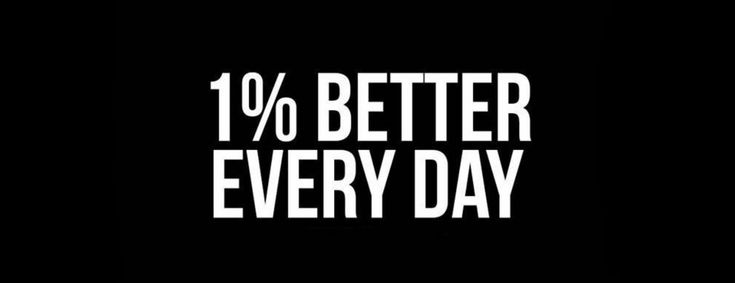

<div align="center">

# ALIYAN SALEEM


</div>

<br />

## About Me

Junior IT Professional and Web & App Developer based in Karachi, Pakistan, with hands-on experience in full-stack web development, Flutter mobile app development, and AI-assisted programming. Skilled in designing responsive interfaces, managing data workflows, and building efficient, scalable solutions. Currently completing a Diploma in Software Technology while delivering real-world client projects.

<br />

## Featured Projects

<table>
<tr>
<td width="50%" valign="top">

**Trend In Law**
E-commerce platform with custom UI and full shopping flow.

Live: https://buildsbyaliyan.github.io/trendinlaw-ecommerce/
Repo: https://github.com/BuildsByAliyan/trendinlaw-ecommerce

Built with: HTML, CSS, JavaScript

</td>
<td width="50%" valign="top">

**Libaas Studio**
Modern fashion brand storefront with responsive design.

Live: https://buildsbyaliyan.github.io/libas-studio/
Repo: https://github.com/BuildsByAliyan/libas-studio

Built with: HTML, CSS, JavaScript

</td>
</tr>
<tr>
<td width="50%" valign="top">

**Smart QR Hub**
QR code generator with multiple customization options.

Live: https://buildsbyaliyan.github.io/Smart-QR-Generator/
Repo: https://github.com/BuildsByAliyan/Smart-QR-Generator

Built with: React, QR Libraries

</td>
<td width="50%" valign="top">

**GlobeX Converter**
Currency and unit conversion tool with a clean, fast UI.

Live: https://buildsbyaliyan.github.io/GlobeX-Converter/
Repo: https://github.com/BuildsByAliyan/GlobeX-Converter

Built with: JavaScript

</td>
</tr>
<tr>
<td width="50%" valign="top">

**SlideAuthPage**
Animated sliding authentication page UI.

Live: https://buildsbyaliyan.github.io/SlideAuthPage/
Repo: https://github.com/BuildsByAliyan/SlideAuthPage

Built with: HTML, CSS, JavaScript

</td>
<td width="50%" valign="top">

**AliyanCollection Ecommerce**
Full e-commerce storefront concept with product catalog.

Live: https://buildsbyaliyan.github.io/AliyanCollection-Ecommerce/
Repo: https://github.com/BuildsByAliyan/AliyanCollection-Ecommerce

Built with: HTML, CSS, JavaScript

</td>
</tr>
</table>

<br />

## Tech Stack

**Languages & Frontend**


**Frameworks & Tools**


**Scripting & Systems**


**Design & Productivity**


<br />

## GitHub Analytics

<table align="center" width="100%">
<tr>
<td width="48%" valign="top">


</td>
<td width="48%" valign="top">


</td>
</tr>
</table>

<div align="center">


</div>

<br />

## Current Focus

```
Learning      : Advanced React Patterns, Flutter State Management, AI Integration
Building      : Client projects in Web Development and UI/UX Design
Open To       : Freelance Work, Junior Developer Roles, Collaborations
```

<br />

## Let's Connect

<div align="center">

[](https://www.linkedin.com/in/aliyan-saleem-02a596378/)
[](https://www.instagram.com/creativestudi0.pk_)
[](https://portfolio-aliyan-saleem.vercel.app/)
[](https://wa.me/923700256087)

</div>

<br />

<div align="center">



</div>

<br />

<div align="center">
<sub>© 2026 Aliyan Saleem. All rights reserved.</sub>
</div>
